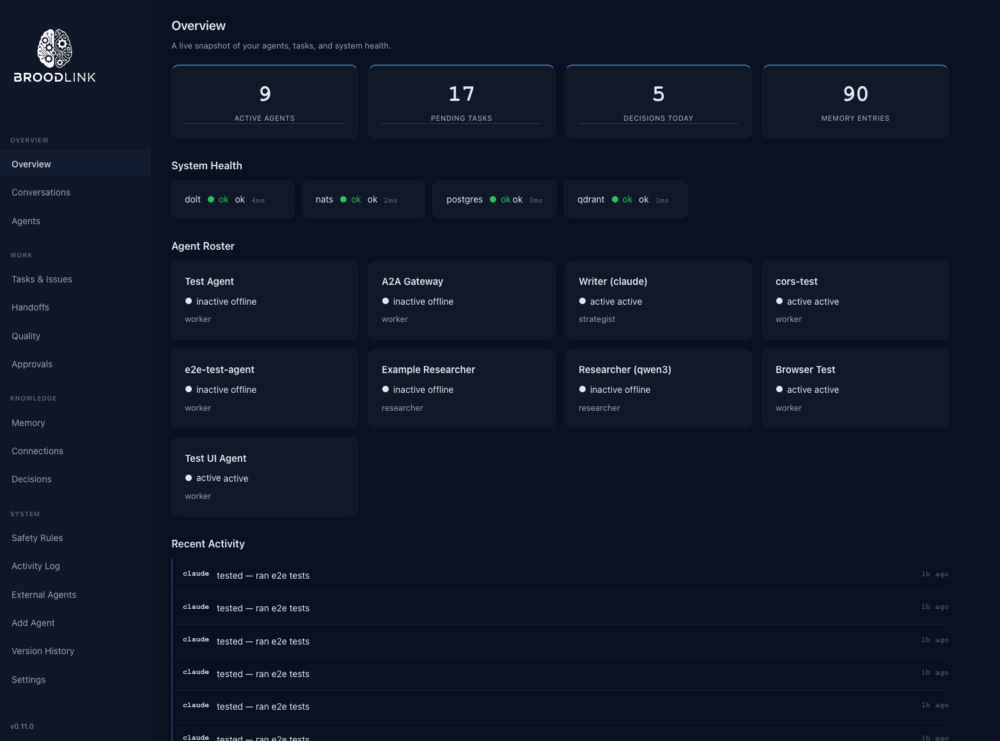

# Broodlink

Broodlink lets multiple AI agents work together. Instead of one AI working alone, Broodlink connects several agents — each with different strengths — so they can share knowledge, delegate tasks to each other, and coordinate their work through a single system.

**How it works:** Every agent connects to a central tool API (beads-bridge) using JWT authentication. When an agent stores a memory, creates a task, or sends a message, beads-bridge routes it to the right database. A coordinator service watches for new tasks and assigns them to the best available agent. A heartbeat service keeps everything healthy. All communication flows through NATS messaging, so agents stay decoupled and the system scales naturally.

**Copyright (C) 2025-2026 Neven Kordic <neven@broodlink.ai>**



## Quick Start

```bash
# Option A: One-shot bootstrap (installs everything from scratch)
bash scripts/bootstrap.sh

# Option B: Step by step
bash scripts/secrets-init.sh              # Generate keys + secrets
bash scripts/db-setup.sh                  # Create databases + tables
bash scripts/build.sh                     # Build all Rust services + Hugo site
bash scripts/start-services.sh            # Start all 7 services
```

After startup, you'll have:

| URL | What |
|-----|------|
| http://localhost:1313 | Dashboard (Hugo) |
| http://localhost:1313/control/ | Control Panel (admin) |
| http://localhost:3310/health | beads-bridge API |
| http://localhost:3312/api/v1/health | status-api |
| http://localhost:3311/health | MCP server |
| http://localhost:3313/health | A2A gateway + webhook gateway |

## Architecture

```
                    Agents (Claude, Qwen, custom bots, ...)
                            │
                    ┌───────▼───────┐
                    │ beads-bridge  │ :3310  Tool API (84 tools)
                    │               │   JWT RS256 + Rate Limiting
                    └──┬────┬───┬──┘
                       │    │   │
          ┌────────────┘    │   └────────────┐
          │                 │                │
  ┌───────▼──────┐  ┌──────▼──────┐  ┌──────▼──────┐
  │    Dolt      │  │  Postgres   │  │    NATS     │
  │  :3307       │  │  :5432      │  │  :4222      │
  │ (versioned)  │  │ (hot paths) │  │ (messaging) │
  └──────────────┘  └──────┬──────┘  └──────┬──────┘
                           │                │
                    ┌──────▼──────┐  ┌──────▼──────┐
                    │ embedding-  │  │ coordinator │
                    │ worker      │  │             │
                    └──────┬──────┘  └─────────────┘
                           │
              ┌────────────┼────────────┐
              │            │            │
      ┌───────▼──┐  ┌─────▼────┐  ┌───▼────────┐
      │  Ollama  │  │  Qdrant  │  │ heartbeat  │
      │  :11434  │  │  :6333   │  │ (5m cycle) │
      └──────────┘  └──────────┘  └────────────┘

  ┌──────────────┐  ┌──────────────┐  ┌──────────────┐
  │  status-api  │  │  mcp-server  │  │ a2a-gateway  │
  │  :3312       │  │  :3311       │  │  :3313       │
  └──────┬───────┘  └──────────────┘  └──────────────┘
         │
  ┌──────▼───────┐
  │  Hugo Site   │
  │  :1313       │
  └──────────────┘
```

### Data Flow

1. **Tool calls** -- Agent sends POST to `/api/v1/tool/<name>` -- beads-bridge validates JWT (kid-based multi-key), checks rate limits, guardrails, and budget, writes audit log, dispatches to Dolt or Postgres
2. **Memory + embeddings + search** -- `store_memory` inserts to Dolt + Postgres full-text index + outbox row -- embedding-worker polls outbox every 2s -- Ollama generates vector -- Qdrant upsert -- extracts entities/relationships via LLM and stores in knowledge graph (Postgres `kg_entities`/`kg_edges` + Qdrant `broodlink_kg_entities`) -- `hybrid_search` fuses BM25 (Postgres tsvector) + vector (Qdrant) with temporal decay and optional reranking -- `graph_search`/`graph_traverse` query the knowledge graph -- graceful degradation to BM25-only or vector-only if a backend is down -- `delete_memory` cleans up Dolt, Postgres, and Qdrant vectors
3. **Task routing** -- `create_task` writes to Postgres + publishes NATS -- coordinator scores all eligible agents (success rate, load, cost, recency) -- claims atomically -- dispatches to winning agent -- failed tasks land in dead-letter queue with auto-retry (exponential backoff)
4. **Workflow orchestration** -- `start_workflow` creates a `workflow_runs` row + publishes NATS -- coordinator loads formula TOML -- supports conditional steps (`when` expressions), per-step retries, parallel step groups, step timeouts, and `on_failure` error handlers -- all step results collected in `step_results` JSONB
5. **Multi-agent collaboration** -- `decompose_task` splits work into sub-tasks with merge strategies (concatenate, vote, best) -- `create_workspace` + `workspace_read`/`workspace_write` for shared context -- coordinator tracks child completions and auto-merges results
6. **Budget enforcement** -- `check_budget` middleware deducts tokens per tool call -- `set_budget`/`get_budget` tools for management -- daily replenishment via heartbeat -- `BudgetExhausted` error (402) blocks calls when depleted
7. **Webhook gateway** -- a2a-gateway receives Slack slash commands, Teams bot messages, Telegram updates -- parses `/broodlink <command>` into tool calls -- outbound notifications for agent.offline, task.failed, budget.low, workflow events, guardrail violations
8. **Conversational gateway** (v0.7.0) -- a2a-gateway receives Slack/Teams/Telegram messages → creates chat sessions → routes to coordinator for task creation → delivers replies via platform-specific APIs -- `list_chat_sessions`/`reply_to_chat` tools for agent interaction -- direct Ollama LLM chat with tool calling (Brave Search for real-time queries: weather, news, scores) -- efficiency safeguards: Ollama concurrency semaphore (configurable, default 1), Brave search result cache (5-min TTL), duplicate message suppression (30s dedup window checked before any DB/bridge work), periodic typing indicator refresh (every 4s via `tokio::select!`) -- busy/dedup replies excluded from conversation history to prevent context pollution -- Telegram access code authentication: random 8-char code generated on bot registration, new users must send the code to be added to the allow list -- cascade delete on bot disconnect removes all related chat data -- NATS-based credential cache invalidation: status-api publishes `credentials_changed` on register/disconnect, a2a-gateway subscribes and immediately invalidates its credential cache (no stale window)
9. **Formula registry** (v0.7.0) -- coordinator loads formula definitions from Postgres `formula_registry` table (TOML fallback) -- `list_formulas`/`get_formula`/`create_formula`/`update_formula` tools for CRUD -- seed script populates system formulas from `.beads/formulas/`
10. **Dashboard auth** (v0.7.0) -- session-based RBAC (viewer/operator/admin) -- bcrypt passwords, session tokens in Postgres -- API key fallback when auth disabled -- role enforcement in JS control panel
11. **Heartbeat cycle** (every 5 min) -- Dolt commit, Beads issue sync, agent metrics computation, daily summary generation, stale agent deactivation, memory search index sync (Dolt → Postgres), knowledge graph backfill, KG entity/edge expiry with weight decay, daily budget replenishment, chat session expiry, dashboard session cleanup

### Databases

| Database | Port | Purpose |
|----------|------|---------|
| **Dolt** (MySQL wire protocol) | 3307 | Versioned brain: agent_memory, decisions, agent_profiles, projects, skills, beads_issues, daily_summary |
| **PostgreSQL** | 5432 | Hot paths: task_queue, messages, work_log, audit_log, outbox, residency_log, approval_policies, approval_gates, agent_metrics, delegations, streams, guardrail_policies, guardrail_violations, a2a_task_map, workflow_runs, memory_search_index (BM25 full-text), kg_entities, kg_edges, kg_entity_memories, budget_transactions, tool_cost_map, dead_letter_queue, task_decompositions, shared_workspaces, webhook_endpoints, webhook_log, chat_sessions, chat_messages, chat_reply_queue, formula_registry, dashboard_users, dashboard_sessions, platform_credentials |
| **Qdrant** | 6333 | Semantic vector search: `broodlink_memory` (768-dim nomic-embed-text) for hybrid_search, `broodlink_kg_entities` (768-dim) for knowledge graph entity similarity |

## Services

| Service | Port | Transport | Purpose |
|---------|------|-----------|---------|
| beads-bridge | 3310 | HTTP + NATS | Universal tool API (84 tools), JWT RS256 auth with kid-based multi-key validation, rate limiting, budget enforcement, circuit breakers, JWKS endpoint, SSE streaming |
| coordinator | -- | NATS only | Smart task routing with weighted scoring, atomic claiming, exponential backoff, dead-letter queue with auto-retry, workflow orchestration with conditional steps, parallel groups, per-step retries, timeouts, and error handlers, multi-agent task decomposition |
| heartbeat | -- | NATS + DB | 5-min sync cycle: Dolt commit, Beads sync, agent metrics, daily summary, stale agent deactivation, KG entity/edge expiry with weight decay, daily budget replenishment |
| embedding-worker | -- | NATS + DB | Outbox poll -- Ollama `nomic-embed-text` embeddings -- Qdrant upsert -- LLM entity extraction for knowledge graph, circuit breakers |
| status-api | 3312 | HTTP | Dashboard API with API key + session auth (RBAC on all mutations), CORS, security headers (HSTS, CSP, X-Frame-Options), SSE stream proxy, control panel endpoints (agent toggle, budget set, task cancel, webhook CRUD, guardrails, DLQ), chat session management, formula registry CRUD, user management |
| mcp-server | 3311 | HTTP + stdio | MCP protocol server (streamable HTTP + legacy stdio), proxies bridge tools |
| a2a-gateway | 3313 | HTTP | Google A2A protocol gateway, AgentCard discovery, cross-system task delegation, webhook gateway for Slack/Teams/Telegram with inbound command parsing and outbound event notifications, conversational chat gateway with session management, greeting support, direct Ollama LLM chat with Brave Search tool calling, concurrency semaphore, search cache, dedup, and typing refresh |

### Shared Crates

| Crate | Purpose |
|-------|---------|
| broodlink-config | `Config` struct loaded from `config.toml` with `BROODLINK_*` env var overrides |
| broodlink-secrets | `SecretsProvider` trait -- `SopsProvider` (dev) and `InfisicalProvider` (prod) |
| broodlink-telemetry | OpenTelemetry integration with OTLP export (Jaeger) and W3C trace propagation |
| broodlink-runtime | Shared utilities: `CircuitBreaker`, `shutdown_signal`, cluster-aware `connect_nats` |

## Configuration

All configuration lives in `config.toml`. Every field can be overridden with environment variables using the `BROODLINK_` prefix:

| Env Var | Purpose |
|---------|---------|
| `BROODLINK_CONFIG` | Path to config file (default: `config.toml`) |
| `BROODLINK_DOLT_HOST` | Override Dolt hostname |
| `BROODLINK_DOLT_PORT` | Override Dolt port |
| `BROODLINK_POSTGRES_HOST` | Override Postgres hostname |
| `BROODLINK_POSTGRES_PORT` | Override Postgres port |

### Deployment Profiles

- **dev**: TLS off, SOPS secrets provider, relaxed audit residency
- **prod**: Mutual TLS on inter-service connections, Infisical secrets provider, strict audit residency, NATS clustering, Postgres read replicas

## Testing

```bash
cargo test --workspace                    # 249 unit tests
bash tests/run-all.sh                     # 22 integration test suites
bash tests/e2e.sh                         # 124 end-to-end tests (requires running services)
bash tests/v060-regression.sh             # 164 v0.6.0 regression tests
```

The E2E suite covers: service health, JWT/API key auth, all tool categories, status API endpoints, background service verification, SSE streaming, NATS integration, error handling, database round-trips, semantic search, hybrid memory search, knowledge graph tools, chat sessions, and login page. The v0.6.0 regression suite covers: budget enforcement, DLQ tooling, OTLP telemetry, KG expiry, JWT rotation, workflow branching, dashboard control panel, multi-agent collaboration, and webhooks. v0.7.0 adds chat integration, formula registry, and dashboard auth test suites.

## Prerequisites

- Rust 1.75+ with `cargo-deny`
- Hugo 0.120+ (extended edition)
- age + SOPS (secrets management)
- Podman + podman-compose
- Dolt SQL server
- PostgreSQL 15+
- NATS 2.10+
- Qdrant 1.7+
- Ollama with `nomic-embed-text` model
- Python 3.10+ (for agent SDK)

## Scripts

| Script | Purpose |
|--------|---------|
| `scripts/bootstrap.sh` | One-shot setup: prerequisites check, infrastructure, secrets, databases, build, onboard, start |
| `scripts/start-services.sh` | Start/stop all 7 Rust services + Hugo (`--stop` to stop) |
| `scripts/build.sh` | cargo deny + tests + release build + Hugo |
| `scripts/secrets-init.sh` | Generate JWT keypair, create `.secrets/env`, scaffold `secrets.skeleton.json` |
| `scripts/db-setup.sh` | Create databases, run all 26 migrations, create Qdrant collections |
| `scripts/rotate-jwt-keys.sh` | Generate new JWT keypair with kid fingerprint, retire old keys after grace period |
| `scripts/backfill-search-index.sh` | One-time backfill of Postgres memory_search_index from Dolt agent_memory |
| `scripts/backfill-knowledge-graph.sh` | One-time backfill of knowledge graph entities from existing memories |
| `scripts/seed-formulas.sh` | Seed formula_registry from `.beads/formulas/*.formula.toml` (idempotent) |
| `scripts/create-admin.sh` | Create dashboard admin user with bcrypt password |
| `scripts/start-gateway.sh` | Start a2a-gateway with `.env` sourcing |
| `scripts/onboard-agent.sh` | Register an agent: generate JWT, insert profile, create system prompt |
| `scripts/dev.sh` | Start/stop dev stack (Podman containers + services) |
| `scripts/launchagents.sh` | Install/manage macOS LaunchAgents for all services |
| `scripts/generate-tls.sh` | Generate self-signed CA + server certificates for TLS |

## Directory Structure

```
broodlink/
├── crates/
│   ├── broodlink-config/         # Configuration loading + validation
│   ├── broodlink-secrets/        # SecretsProvider trait + implementations
│   ├── broodlink-telemetry/      # OpenTelemetry + OTLP export
│   └── broodlink-runtime/        # CircuitBreaker, shutdown_signal, connect_nats
├── rust/
│   ├── beads-bridge/             # Universal tool API (84 tools)
│   ├── coordinator/              # NATS task routing + workflow orchestration
│   ├── heartbeat/                # Periodic sync + health checks
│   ├── embedding-worker/         # Outbox → Ollama → Qdrant pipeline + KG entity extraction
│   ├── status-api/               # Dashboard API + control panel endpoints
│   ├── mcp-server/               # MCP protocol server
│   └── a2a-gateway/              # A2A protocol gateway + webhook gateway
├── agents/                       # Python agent SDK (any OpenAI-compatible LLM)
├── status-site/                  # Hugo dashboard (WCAG 2.1 AA)
│   └── themes/broodlink-status/
├── migrations/                   # SQL migrations (26 files, additive only)
│   ├── 001_dolt_brain.sql
│   ├── 002_postgres_hotpaths.sql
│   ├── 003_postgres_functions.sql
│   ├── 004_approval_gates.sql
│   ├── 005_agent_metrics.sql
│   ├── 005b_agent_max_concurrent.sql
│   ├── 006_negotiations.sql
│   ├── 007_streams.sql
│   ├── 008_guardrails.sql
│   ├── 008b_agent_budget_tokens.sql
│   ├── 009_a2a_gateway.sql
│   ├── 010_task_result.sql
│   ├── 011_workflow_orchestration.sql
│   ├── 012_memory_fulltext.sql
│   ├── 013_knowledge_graph.sql
│   ├── 014_budget_enforcement.sql
│   ├── 015_dead_letter_queue.sql
│   ├── 016_workflow_branching.sql
│   ├── 017_multi_agent_collab.sql
│   ├── 018_webhooks.sql
│   ├── 019_chat_sessions.sql
│   ├── 020_formula_registry.sql
│   ├── 021_dashboard_auth.sql
│   └── 024_platform_credentials_meta.sql
├── tests/                        # Integration + E2E test suites
├── templates/                    # System prompt template for agent onboarding
├── scripts/                      # Build, setup, onboarding, and dev scripts
├── launchagents/                 # macOS LaunchAgent plists (8 services)
├── .beads/formulas/              # Workflow formula definitions
├── .secrets/                     # Encrypted secrets (age + SOPS)
├── config.toml                   # Application configuration
├── deny.toml                     # cargo-deny license/ban rules
├── podman-compose.yaml           # Dev container orchestration
└── podman-compose.prod.yaml      # Prod: 3-node NATS, PG replicas, TLS
```

## Beads Workflow Formulas

Located in `.beads/formulas/`:

| Formula | Purpose |
|---------|---------|
| `research.formula.toml` | Multi-step web research with source evaluation |
| `build-feature.formula.toml` | End-to-end feature: plan, implement, test, document |
| `daily-review.formula.toml` | Daily ops review: metrics, blockers, summary |
| `knowledge-gap.formula.toml` | Audit memory, prioritize gaps, research and fill |

## Security

Broodlink applies defence-in-depth across all services:

| Layer | Mechanism |
|-------|-----------|
| **Authentication** | JWT RS256 (beads-bridge, MCP), API key + session tokens (status-api), Bearer token (a2a-gateway) |
| **Authorization** | RBAC (viewer/operator/admin) enforced on every status-api mutation endpoint via `require_role()` |
| **Transport** | HSTS, CSP `default-src 'self'`, X-Frame-Options DENY, X-Content-Type-Options nosniff on all HTTP services |
| **Input validation** | 10 MiB body limits, query LIMIT clamping (1–1000), anchored regex, path traversal prevention, webhook SSRF blocking |
| **Secrets** | SOPS/age encryption, constant-time API key comparison, bcrypt passwords (cost 12), 12-char minimum policy |
| **Resilience** | Fail-closed guardrails, fail-closed condition evaluation, circuit breakers, rate limiting, SSE stream caps (100 max, 1h TTL) |
| **Container** | `read_only: true`, `no-new-privileges`, dropped capabilities in production compose |
| **CI** | `cargo-deny` license and advisory audit |

## External Integrations

- **MCP**: Agents connect via the mcp-server, which proxies all 84 bridge tools over MCP protocol (streamable HTTP or stdio transport) with JWT authentication
- **A2A**: The a2a-gateway implements Google's Agent-to-Agent protocol -- exposes an AgentCard at `/.well-known/agent.json`, accepts task delegation from external A2A-compatible agents, and bridges them to internal Broodlink tasks
- **Webhooks**: The a2a-gateway also serves as a webhook gateway -- receives Slack slash commands (`/broodlink agents`), Teams bot messages, and Telegram bot updates -- parses commands into bridge tool calls -- sends outbound notifications (agent.offline, task.failed, budget.low, workflow events, guardrail violations) to configured webhook endpoints

## License

GNU Affero General Public License v3.0 or later -- see [LICENSE](LICENSE).
