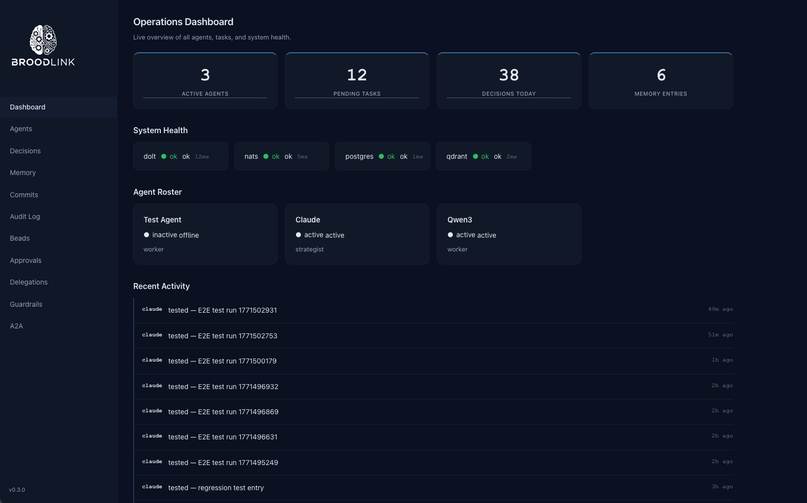

# Broodlink

Broodlink lets multiple AI agents work together. Instead of one AI working alone, Broodlink connects several agents — each with different strengths — so they can share knowledge, delegate tasks to each other, and coordinate their work through a single system.

**How it works:** Every agent connects to a central tool API (beads-bridge) using JWT authentication. When an agent stores a memory, creates a task, or sends a message, beads-bridge routes it to the right database. A coordinator service watches for new tasks and assigns them to the best available agent. A heartbeat service keeps everything healthy. All communication flows through NATS messaging, so agents stay decoupled and the system scales naturally.

**Copyright (C) 2025-2026 Neven Kordic <neven@broodlink.ai>**



## Quick Start

```bash
# Option A: One-shot bootstrap (installs everything from scratch)
bash scripts/bootstrap.sh

# Option B: Step by step
bash scripts/secrets-init.sh              # Generate keys + secrets
bash scripts/db-setup.sh                  # Create databases + tables
bash scripts/build.sh                     # Build all Rust services + Hugo site
bash scripts/start-services.sh            # Start all 7 services
```

After startup, you'll have:

| URL | What |
|-----|------|
| http://localhost:1313 | Dashboard (Hugo) |
| http://localhost:3310/health | beads-bridge API |
| http://localhost:3312/api/v1/health | status-api |
| http://localhost:3311/health | MCP server |
| http://localhost:3313/health | A2A gateway |

## Architecture

```
                    Agents (Claude, Qwen, custom bots, ...)
                            │
                    ┌───────▼───────┐
                    │ beads-bridge  │ :3310  Tool API (62 tools)
                    │               │   JWT RS256 + Rate Limiting
                    └──┬────┬───┬──┘
                       │    │   │
          ┌────────────┘    │   └────────────┐
          │                 │                │
  ┌───────▼──────┐  ┌──────▼──────┐  ┌──────▼──────┐
  │    Dolt      │  │  Postgres   │  │    NATS     │
  │  :3307       │  │  :5432      │  │  :4222      │
  │ (versioned)  │  │ (hot paths) │  │ (messaging) │
  └──────────────┘  └──────┬──────┘  └──────┬──────┘
                           │                │
                    ┌──────▼──────┐  ┌──────▼──────┐
                    │ embedding-  │  │ coordinator │
                    │ worker      │  │             │
                    └──────┬──────┘  └─────────────┘
                           │
              ┌────────────┼────────────┐
              │            │            │
      ┌───────▼──┐  ┌─────▼────┐  ┌───▼────────┐
      │  Ollama  │  │  Qdrant  │  │ heartbeat  │
      │  :11434  │  │  :6333   │  │ (5m cycle) │
      └──────────┘  └──────────┘  └────────────┘

  ┌──────────────┐  ┌──────────────┐  ┌──────────────┐
  │  status-api  │  │  mcp-server  │  │ a2a-gateway  │
  │  :3312       │  │  :3311       │  │  :3313       │
  └──────┬───────┘  └──────────────┘  └──────────────┘
         │
  ┌──────▼───────┐
  │  Hugo Site   │
  │  :1313       │
  └──────────────┘
```

### Data Flow

1. **Tool calls** -- Agent sends POST to `/api/v1/tool/<name>` -- beads-bridge validates JWT, checks rate limits and guardrails, writes audit log, dispatches to Dolt or Postgres
2. **Memory + embeddings + search** -- `store_memory` inserts to Dolt + Postgres full-text index + outbox row -- embedding-worker polls outbox every 2s -- Ollama generates vector -- Qdrant upsert -- `hybrid_search` fuses BM25 (Postgres tsvector) + vector (Qdrant) with temporal decay and optional reranking -- graceful degradation to BM25-only or vector-only if a backend is down
3. **Task routing** -- `create_task` writes to Postgres + publishes NATS -- coordinator scores all eligible agents (success rate, load, cost, recency) -- claims atomically -- dispatches to winning agent
4. **Workflow orchestration** -- `start_workflow` creates a `workflow_runs` row + publishes NATS -- coordinator loads formula TOML, creates step tasks sequentially -- completing a step auto-creates the next with accumulated results -- all step results collected in `step_results` JSONB
5. **Heartbeat cycle** (every 5 min) -- Dolt commit, Beads issue sync, agent metrics computation, daily summary generation, stale agent deactivation, memory search index sync (Dolt → Postgres)

### Databases

| Database | Port | Purpose |
|----------|------|---------|
| **Dolt** (MySQL wire protocol) | 3307 | Versioned brain: agent_memory, decisions, agent_profiles, projects, skills, beads_issues, daily_summary |
| **PostgreSQL** | 5432 | Hot paths: task_queue, messages, work_log, audit_log, outbox, residency_log, approval_policies, approval_gates, agent_metrics, delegations, streams, guardrail_policies, guardrail_violations, a2a_task_map, workflow_runs, memory_search_index (BM25 full-text) |
| **Qdrant** | 6333 | Semantic vector search (`broodlink_memory` collection, 768-dim nomic-embed-text), used by `hybrid_search` for vector scoring |

## Services

| Service | Port | Transport | Purpose |
|---------|------|-----------|---------|
| beads-bridge | 3310 | HTTP + NATS | Universal tool API (62 tools), JWT RS256 auth, rate limiting, circuit breakers, SSE streaming |
| coordinator | -- | NATS only | Smart task routing with weighted scoring, atomic claiming, exponential backoff, dead-letter queue, sequential workflow orchestration |
| heartbeat | -- | NATS + DB | 5-min sync cycle: Dolt commit, Beads sync, agent metrics, daily summary, stale agent deactivation |
| embedding-worker | -- | NATS + DB | Outbox poll -- Ollama `nomic-embed-text` embeddings -- Qdrant upsert, circuit breakers |
| status-api | 3312 | HTTP | Dashboard API with API key auth, CORS, and SSE stream proxy |
| mcp-server | 3311 | HTTP + stdio | MCP protocol server (streamable HTTP + legacy stdio), proxies bridge tools |
| a2a-gateway | 3313 | HTTP | Google A2A protocol gateway, AgentCard discovery, cross-system task delegation |

### Shared Crates

| Crate | Purpose |
|-------|---------|
| broodlink-config | `Config` struct loaded from `config.toml` with `BROODLINK_*` env var overrides |
| broodlink-secrets | `SecretsProvider` trait -- `SopsProvider` (dev) and `InfisicalProvider` (prod) |
| broodlink-telemetry | OpenTelemetry integration with OTLP export (Jaeger) and W3C trace propagation |
| broodlink-runtime | Shared utilities: `CircuitBreaker`, `shutdown_signal`, cluster-aware `connect_nats` |

## Configuration

All configuration lives in `config.toml`. Every field can be overridden with environment variables using the `BROODLINK_` prefix:

| Env Var | Purpose |
|---------|---------|
| `BROODLINK_CONFIG` | Path to config file (default: `config.toml`) |
| `BROODLINK_DOLT_HOST` | Override Dolt hostname |
| `BROODLINK_DOLT_PORT` | Override Dolt port |
| `BROODLINK_POSTGRES_HOST` | Override Postgres hostname |
| `BROODLINK_POSTGRES_PORT` | Override Postgres port |

### Deployment Profiles

- **dev**: TLS off, SOPS secrets provider, relaxed audit residency
- **prod**: Mutual TLS on inter-service connections, Infisical secrets provider, strict audit residency, NATS clustering, Postgres read replicas

## Testing

```bash
cargo test --workspace                    # 148 unit tests
bash tests/run-all.sh                     # 15 integration test suites
bash tests/e2e.sh                         # 73 end-to-end tests (requires running services)
```

The E2E suite covers: service health, JWT/API key auth, all tool categories, status API endpoints, background service verification, SSE streaming, NATS integration, error handling, database round-trips, semantic search, and hybrid memory search.

## Prerequisites

- Rust 1.75+ with `cargo-deny`
- Hugo 0.120+ (extended edition)
- age + SOPS (secrets management)
- Podman + podman-compose
- Dolt SQL server
- PostgreSQL 15+
- NATS 2.10+
- Qdrant 1.7+
- Ollama with `nomic-embed-text` model
- Python 3.10+ (for agent SDK)

## Scripts

| Script | Purpose |
|--------|---------|
| `scripts/bootstrap.sh` | One-shot setup: prerequisites check, infrastructure, secrets, databases, build, onboard, start |
| `scripts/start-services.sh` | Start/stop all 7 Rust services + Hugo (`--stop` to stop) |
| `scripts/build.sh` | cargo deny + tests + release build + Hugo |
| `scripts/secrets-init.sh` | Generate JWT keypair, create `.secrets/env`, scaffold `secrets.skeleton.json` |
| `scripts/db-setup.sh` | Create databases, run all 14 migrations, create Qdrant collection |
| `scripts/backfill-search-index.sh` | One-time backfill of Postgres memory_search_index from Dolt agent_memory |
| `scripts/onboard-agent.sh` | Register an agent: generate JWT, insert profile, create system prompt |
| `scripts/dev.sh` | Start/stop dev stack (Podman containers + services) |
| `scripts/launchagents.sh` | Install/manage macOS LaunchAgents for all services |
| `scripts/generate-tls.sh` | Generate self-signed CA + server certificates for TLS |

## Directory Structure

```
broodlink/
├── crates/
│   ├── broodlink-config/         # Configuration loading + validation
│   ├── broodlink-secrets/        # SecretsProvider trait + implementations
│   ├── broodlink-telemetry/      # OpenTelemetry + OTLP export
│   └── broodlink-runtime/        # CircuitBreaker, shutdown_signal, connect_nats
├── rust/
│   ├── beads-bridge/             # Universal tool API (62 tools)
│   ├── coordinator/              # NATS task routing + workflow orchestration
│   ├── heartbeat/                # Periodic sync + health checks
│   ├── embedding-worker/         # Outbox → Ollama → Qdrant pipeline
│   ├── status-api/               # Read-only dashboard API
│   ├── mcp-server/               # MCP protocol server
│   └── a2a-gateway/              # A2A protocol gateway
├── agents/                       # Python agent SDK (any OpenAI-compatible LLM)
├── status-site/                  # Hugo dashboard (WCAG 2.1 AA)
│   └── themes/broodlink-status/
├── migrations/                   # SQL migrations (14 files, additive only)
│   ├── 001_dolt_brain.sql
│   ├── 002_postgres_hotpaths.sql
│   ├── 003_postgres_functions.sql
│   ├── 004_approval_gates.sql
│   ├── 005_agent_metrics.sql
│   ├── 005b_agent_max_concurrent.sql
│   ├── 006_negotiations.sql
│   ├── 007_streams.sql
│   ├── 008_guardrails.sql
│   ├── 008b_agent_budget_tokens.sql
│   ├── 009_a2a_gateway.sql
│   ├── 010_task_result.sql
│   ├── 011_workflow_orchestration.sql
│   └── 012_memory_fulltext.sql
├── tests/                        # Integration + E2E test suites
├── templates/                    # System prompt template for agent onboarding
├── scripts/                      # Build, setup, onboarding, and dev scripts
├── launchagents/                 # macOS LaunchAgent plists (8 services)
├── .beads/formulas/              # Workflow formula definitions
├── .secrets/                     # Encrypted secrets (age + SOPS)
├── config.toml                   # Application configuration
├── deny.toml                     # cargo-deny license/ban rules
├── podman-compose.yaml           # Dev container orchestration
└── podman-compose.prod.yaml      # Prod: 3-node NATS, PG replicas, TLS
```

## Beads Workflow Formulas

Located in `.beads/formulas/`:

| Formula | Purpose |
|---------|---------|
| `research.formula.toml` | Multi-step web research with source evaluation |
| `build-feature.formula.toml` | End-to-end feature: plan, implement, test, document |
| `daily-review.formula.toml` | Daily ops review: metrics, blockers, summary |
| `knowledge-gap.formula.toml` | Audit memory, prioritize gaps, research and fill |

## External Integrations

- **MCP**: Agents connect via the mcp-server, which proxies all 62 bridge tools over MCP protocol (streamable HTTP or stdio transport) with JWT authentication
- **A2A**: The a2a-gateway implements Google's Agent-to-Agent protocol -- exposes an AgentCard at `/.well-known/agent.json`, accepts task delegation from external A2A-compatible agents, and bridges them to internal Broodlink tasks

## License

GNU Affero General Public License v3.0 or later -- see [LICENSE](LICENSE).
